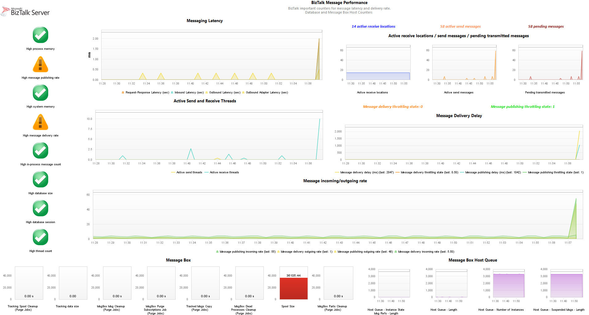
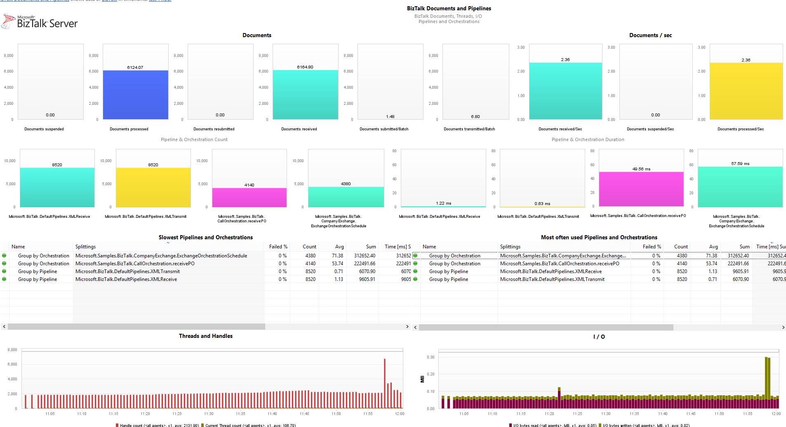
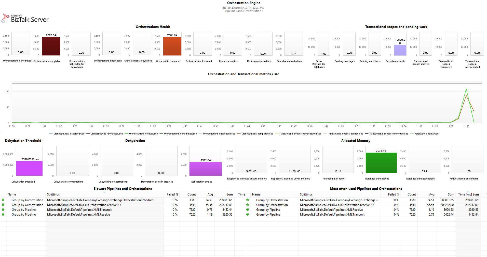
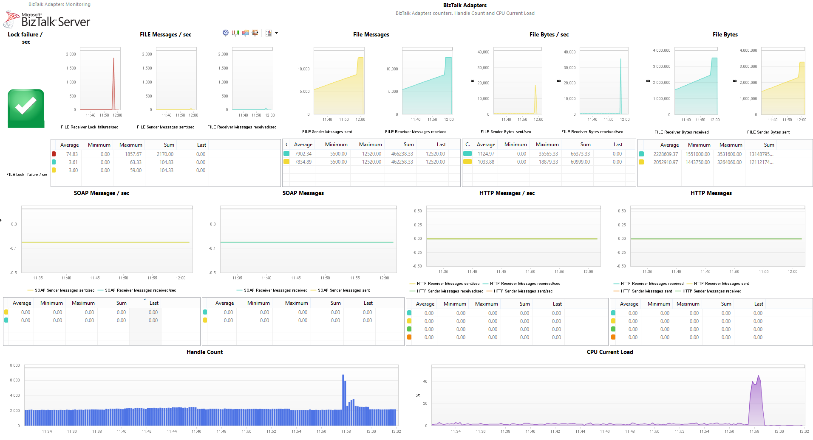
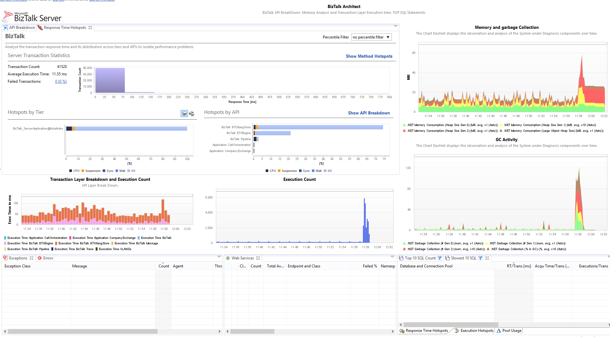
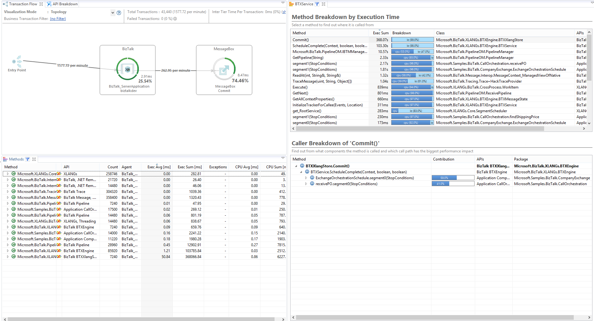

## Dynatrace FastPack for Microsoft BizTalk Server

The dynaTrace FastPack for Microsoft BizTalk Server enables faster performance analysis of BizTalk Environments by providing pre-configured Dashboards, Monitors, System Profile and Sensor Packs for BizTalk.

Find further information in the [dynaTrace community](https://community.dynatrace.com/community/display/DL/BizTalk+FastPack) 

#### Table of Contents
* [Overview](#overview)
* [Installation](#installation)
 * [Monitors installation](#monitorsinstallation) 
 * [Profile installation](#profileinstallation) 
* [Configuration](#configuration)
  * [BizTalk Processes](#configuration1)
  * [Monitors configuration](#configuration2)
* [Monitors](#monitors)
 * [BizTalk MessageBox Performance Monitor (General Counters)](#monitors)
 * [BizTalk MessageBox Performance Monitor (Host Counters)](#monitors)
 * [BizTalk Windows Performance Monitor](#monitors)
* [Dashboards](#dashboards)
 * [BizTalk Message Performance](#msgperformance)
 * [BizTalk Documents and Pipelines Dashboard](#documentspipelines)
 * [BizTalk Orchestration Engine Dashboard](#orchestration)
 * [BizTalk Adapters Dashboard](#adapters)
 * [BizTalk Architect Dashboard](#architect)
 * [BizTalk Deep Analysis Dashboard](#deepanalysis)
* [Problems? Questions? Suggestions?](#feedback)
* [Additional Resources](#resources)
  * [Dynatrace AppMon Documentation](#doc)
  * [Blogs](#blogs)
  * [BizTalk Performance Counters](#biztalkperfom)

## Overview
The dynaTrace FastPack for BizTalk contains everything to get started with analyzing your BizTalk Environment

- A system profile with pre-configured Monitors, Sensor Rules and Agent Mappings
- A set of dashboards to Analyze the Messages performance, Message Box, Orchestrations, Documents, Adapters and Pipeline Performance
- A set of BizTalk Monitoring plugins to monitor BizTalk specific Performance Counters

## Installation

1. Download the latest release of the [BizTalk Monitors FastPack]() and the [BizTalk Profile and Dashboard Fastpack]().
2. In the Dynatrace Client, go to Tools -> Manage Plugins and click "Install Plugin"
	1. Select the BizTalk Monitors Fastpack .DTP and allow it to install.
	2. Select the BizTalk Profile and Dashboards .DTP and allow it to install.

That's it, you have now installed a set of Monitors and a System Profile with Dashboards for your BizTalk Environment. Now you only need to spefify your BizTalk Servers you want to monitor and map the Agents.

## Configuration

### BizTalk Processes

Configure your BizTalk Host Instance processes with the [.NET Agent configuration](https://community.dynatrace.com/community/display/DOCDT63/.NET+Agent+Configuration)
 Tool (BTSNTSvc.exe).
In the System Profile there is an Tier Mapping for Applications deployed in IIS. If you want to monitor them as well, just [configure your IIS Web Server](https://community.dynatrace.com/community/display/DOCDT63/Microsoft+IIS+Web+Server+Agent+Configuration) to map the BizTalk System Profile. 

Once you have maped the BizTalk processes you want to monitor, restart your BizTalk Host Instances via the BizTalk Administration Console.

Verify that the BizTalk Host Instances get correctly assigned to the imported BizTalk System Profile. In the Dynatrace Client go to Status Overview > Agents Overview. If they are mapped correctly, you'll be able to see PurePaths once you put messages through your BizTalk Orchestration.

### Monitors configuration

Once you have the Processes mapped to the System Profile, you'll automatically get the Hosts where your BizTalk Instances are running. The Monitors installed in the first step, will retrieve Performance Counters from your BizTalk Instances. 

1. In the Dynatrace Client go and click on edit in the BizTalk System Profile.
2. Click in Monitors
 - You will see 3 different preconfigured monitors.These are described in [Monitors](#monitors)
3. For each Monitor click on Edit
 1. Configure the Performance Counter Instance under Settings. The 3 different monitors will collect information from 3 different PerfMon Instances at 3 different Levels: BizTalk Application, MessageBox and Host.
 2. Select the Hosts to monitor under Hosts.

### Monitors 
The monitors collect Performance Counters from 3 different instances which are defined at 3 different levels: BizTalk Application, MessageBox and Host.

#### BizTalk MessageBox Performance Monitor (General Counters)

	- Collects information about the MessageBox like Purge Jobs and Spool Size
	- The PerfMon instance is "BizTalkMessageBoxName:HostName"

####BizTalk MessageBox Performance Monitor (Host Counters)
	- Collects information about the Host Queue
	- The PerfMon instance is "BizTalkServerApplicationName:BizTalkMessageBoxName:HostName"

####BizTalk Windows Performance Monitor 
	- Collects information about Orchestration, Message Performance, Adapters running in each instance.
	- The PerfMon instance is "BizTalkServerApplicationName" which per Default is "BizTalkServerApplication"

For more information about Hosts and System Monitors visit [Monitors in the Dynatrace Community](https://community.dynatrace.com/community/display/DOCDT63/Monitors).

# Dashboards

The following Dashboards will be installed in the System Profile.

###BizTalk Message Performance

This dashboard provides helps identifying performance problems in the overall message processing infrastructure of BizTalk. It monitors the Windows Performance Counters of BizTalk and alerts on problems that impact the Host throttling such as

-	High message delivery rate
-	High database size
-	High in-process message queue
-	...

This dashboard gives a high-level performance overview of the most critical component in BizTalk - which is the MessageBox, the Message Box Host queue and the message processing. It also shows the message delivery delay such as pending messages, active publishing delay and active send messages.

###BizTalk Documents and Pipelines Dashboard

This dashboard provides an insight in the messaging performance counters displaying the processed documents by the BizTalk server. The default pipelines will be detected with a business transaction and will be automatically plotted as well as the different orchestrations being processed by BizTalk server. The slowest Pipelines and Orchestrations as well as the most used ones will filtered and shown in a business transaction dashlet. For correlating infrastructure issues with the amount of processed documents, at the bottom of the dashboard, the active threads, handles, read bytes and written bytes by the host will be displayed. 

###BizTalk Orchestration Engine Dashboard

The Orchestration Engine dashboard shows rerformance counters about the orchestration health, the transactional scopes and the pending work. A timeline displays the amount of orchestration and transactional metrics per second such as orchestration created, dehydrated, rehydrated, completed and so fort. The Dyhadration threshold, dynadrations in progress as well as the allocated memory and amount of database transactions will be measured and displayed. The slowest Pipelines and Orchestrations as well as the most used ones will filtered and shown in a business transaction dashlet.

###BizTalk Adapters Dashboard

The Adapters dashboard displays the performance counters for the most common adapters such as File, HTTP and SOAP for the received and sent messages. An alert (lock failure / sec) will be triggered when the BizTalk server starts locking messages for their processing. This usually happens when being under load. The handle count and current CPU load helps identifying problems related to the infrastructure.
 

###BizTalk Architect Dashboard

 
This dashboard provides helps to architecs to identify problems related to:

-	Memory Usage and Garbage Collector Activity
-	Exceptions that are thrown within the BizTalk Orchestration
-	Database and Web Service activity
-	Reponse Time Hotspots among all the transactions and instances of the BizTalk Servers.
-	API Breakdown with the distribution of cpu, sync and wait.
-	Transaction layer breakdown and execution count

The dashboard also shows a performance breakdown into the individual components within BizTalk like BizTalk Core Components, XLANG, Web Services, ...

###BizTalk Deep Analysis Dashboard

This dashboards is composed by the following dashlets:

-	Transaction flow 
-	API breakdown
-	Methods
-	Method Hotspots

This dashboard will help developers understand the called methods and indentify the hotspots inside the BizTalk Server such as code running inside the XLANG BTX Engine. The MessageBox is in the transaction flow exposed as an external call with the help of a method sensor. This method is called when the XLANGStore commits it’s work and sends the message to the COM module, which then commits the message in the database. 

## Problems? Questions? Suggestions?

* Post any problems, questions or suggestions to the Dynatrace Community's [Application Monitoring & UEM Forum](https://answers.dynatrace.com/spaces/146/index.html).

## Additional Resources

### Blogs

- [Identify Performance Bottlenecks in your BizTalk Environment – Part I](http://apmblog.dynatrace.com/2010/02/25/identify-performance-bottlenecks-in-your-biztalk-environment-part-i/)
- [Identify Performance Bottlenecks in your BizTalk Environment – Part II](http://apmblog.dynatrace.com/2010/03/05/identify-performance-bottlenecks-in-your-biztalk-environment-part-ii/)
- [Identify Performance Bottlenecks in your BizTalk Environment – Final Part III](http://apmblog.dynatrace.com/2010/04/01/identify-performance-bottlenecks-in-your-biztalk-environment-final-part-iii/)

### Dynatrace AppMon Documentation

- [Hosts and System Monitors](https://community.dynatrace.com/community/display/DOCDT63/Monitors)
- [ISS Web Server Configuration](https://community.dynatrace.com/community/display/DOCDT63/Microsoft+IIS+Web+Server+Agent+Configuration)
- [.NET Agent Configuration](https://community.dynatrace.com/community/display/DOCDT63/.NET+Agent+Configuration)

### BizTalk Performance Counters

- [Message Box Performance Counters](https://msdn.microsoft.com/en-us/library/aa560410.aspx)
- [Orchestration Engine Performance Counters](https://msdn.microsoft.com/en-us/library/aa561431.aspx)
- [Business Activity Services Performance Counters](https://msdn.microsoft.com/en-us/library/aa547101.aspx)
- [Host Throttling Performance Counters](https://msdn.microsoft.com/en-us/library/aa578302.aspx)
- [Messaging Performance Counters](https://msdn.microsoft.com/en-us/library/aa560810.aspx)
- [Tracking Data Decode Services Performance Counters](https://msdn.microsoft.com/en-us/library/aa560810.aspx)
- [File Adapter Performance Counters](https://msdn.microsoft.com/en-us/library/aa559528.aspx)
- [FTP Adapter Performance Counters](https://msdn.microsoft.com/en-us/library/aa547991.aspx)
- [HTTP Adapter Performance Counters](https://msdn.microsoft.com/en-us/library/aa578671.aspx)
- [MSMQ Adapter Performance Counters](https://msdn.microsoft.com/en-us/library/aa577997.aspx)
- [POP3 Adapter Performance Counters](https://msdn.microsoft.com/en-us/library/aa561995.aspx)
- [SMTP Adapter Performance Counters](https://msdn.microsoft.com/en-us/library/aa547285.aspx)
- [SOAP Adapter Performance Counters](https://msdn.microsoft.com/en-us/library/aa559773.aspx)
- [SQL Adapter Performance Counters](https://msdn.microsoft.com/en-us/library/aa578067.aspx)
- [Windows SharePoint Services Adapter Performance Counters](https://msdn.microsoft.com/en-us/library/aa559786.aspx)
- [BAM Performance Counters](https://msdn.microsoft.com/en-us/library/aa561554.aspx)
