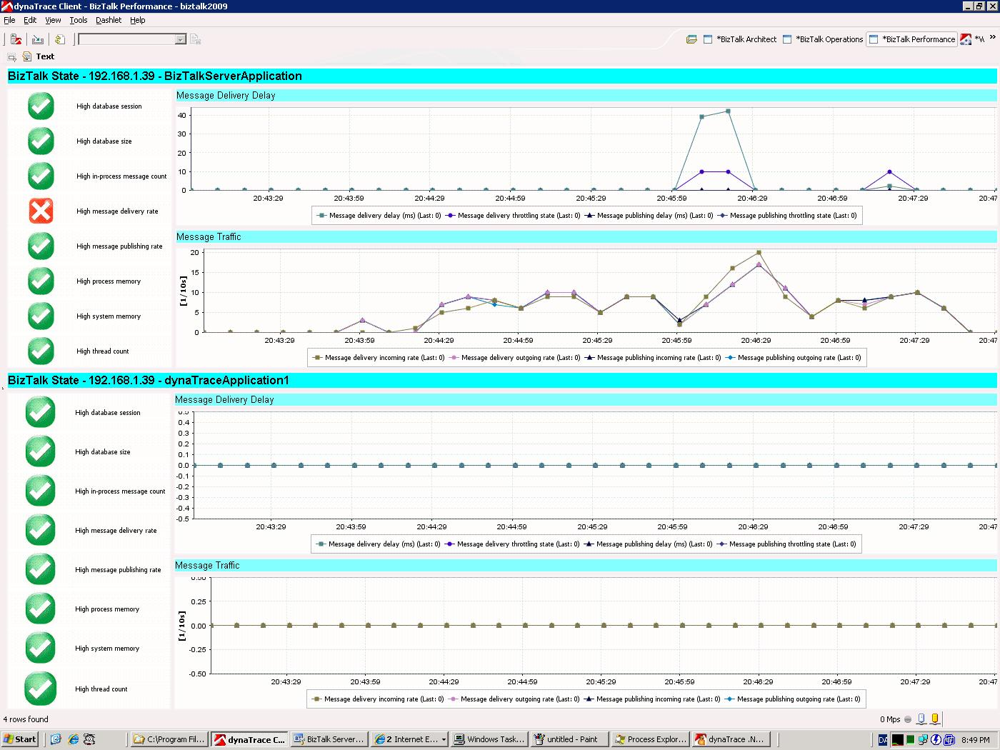
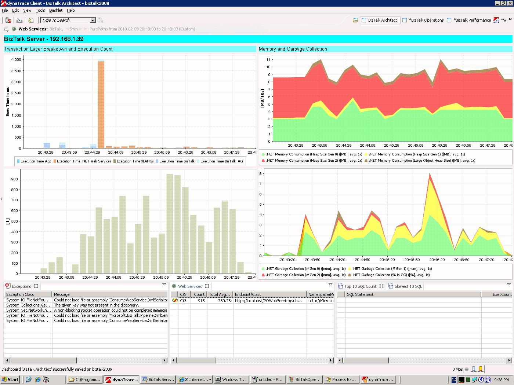
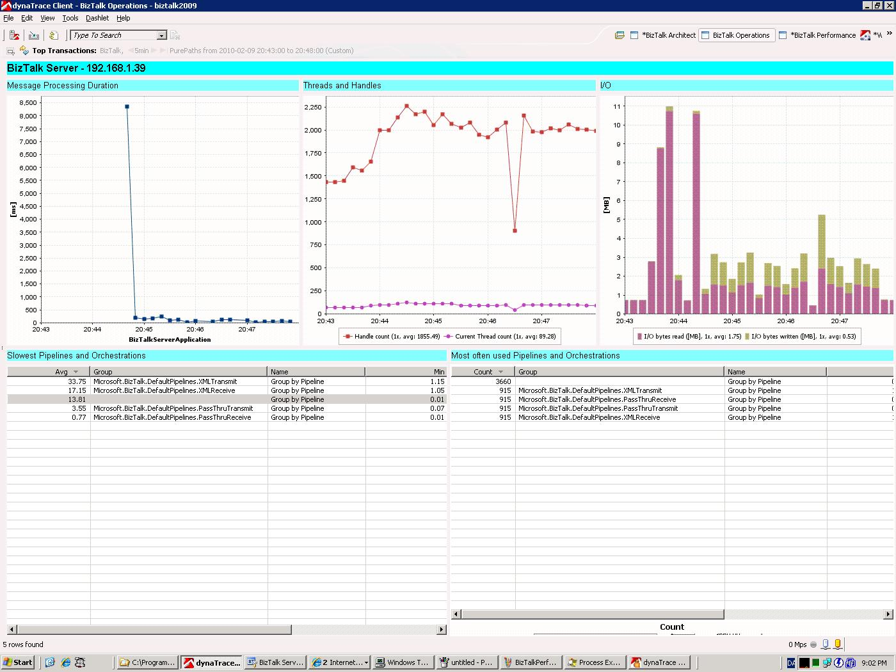

# BizTalk FastPack

## Overview

The dynaTrace FastPack for Microsoft BizTalk Server enables faster performance analysis of BizTalk Environments by providing pre-configured Dashboards, System Profile and Sensor Packs for BizTalk

## FastPack Details

| Name | Microsoft BizTalk FastPack
| :--- | :---
| Version | 3.0
| dynaTrace Version | 3.2, 3.5, 4.x
| Author | dynaTrace software (andreas.grabner@dynatrace.com)
| License | [dynaTrace BSD](dynaTraceBSD.txt)
| Support | [Not Supported](https://community.compuwareapm.com/community/display/DL/Support+Levels#SupportLevels-Community+Supported)
| FastPack Contents | [BizTalk Monitor Plugin](https://github.com/dynaTrace/Dynatrace-BizTalk-Monitor-Plugin)  
| | [FastPack Package (System Profile, Sensor Packs and Dashboards)](dynaTrace_BizTalk_FastPack.zip)

## BizTalk Performance Dashboard

This dashboard provides helps identifying performance problems in the overall message processing infrastructure of BizTalk. It monitors the Windows Performance Counters of BizTalk and alerts on
problems such as

  * High message delivery rate 

  * High database size 

  * High in-process message queue 

  * ... 

This dashboard gives a high-level performance overview of the most critical component in BizTalk - which is the MessageBox and message processing.

## BizTalk Architect Dashboard

This dashboard provides helps an architect to identify problems related to

  * Memory Usage and Garbage Collector Activity 

  * Exceptions that are thrown within the BizTalk Orchestration 

  * Database and Web Service activity 

The dashboard also shows a performance breakdown into the individual components within BizTalk like BizTalk Core Components, XLANG, Web Services, ...

## BizTalk Operations Dashboard

This dashboard provides helps to identify problems related to

  * Extensive I/O 

  * Exhausted and/or over utilized Pipelines and Orchestrations 

Identify which pipelines contribute to the overall performance and how long individual messages take to be processed.

## FastPack Information

The dynaTrace FastPack for BizTalk contains everything to get started with analyzing your BizTalk Environment

  * A system profile with pre-configured Sensor Rules and agent mappings 

  * A set of dashboards to analyze Orchestration, Adapter and Pipeline Performance 

  * A BizTalk Monitoring plugins to monitor BizTalk specific Performance Counters 

The **dynaTrace Blog** contains the following 3 blog entries showing the **BizTalk FastPack in Action** \- how it is used and what information you get from the Dashboards:

  * [Analyze BizTalk via Windows Performance Counters](http://blog.dynatrace.com/2010/02/25/identify-performance-bottlenecks-in-your-biztalk-environment-part-i/)

  * [Analyze BizTalk Adapters and Pipelines](http://blog.dynatrace.com/2010/03/05/identify-performance-bottlenecks-in-your-biztalk-environment-part-ii/)

  * [Analyze BizTalk Orchestration and external service calls](http://blog.dynatrace.com/2010/04/01/identify-performance-bottlenecks-in-your-biztalk-environment-final-part-iii/)

## Installation

  1. Download and extract the [BizTalk Monitor Plugin](https://community/display/DL/BizTalk+Monitor+Plugin)

  2. Extract the attached [FastPack Package](attachments_27230211_1_dynaTrace_BizTalk_FastPack.zip) locally to the computer where the dynaTrace Client is installed. 

  3. Unzip the file. 

  4. Copy the Dashboards into your dynaTrace Server conf\dashboards installation directory 

  5. Import the Sensor Packs to your dynaTrace Server 

  6. Import the BizTalk Monitor Plugin into your dynaTrace Server 

  7. Import the System Profile 

  8. Configure the Host Group of the BizTalk Monitors to match your BizTalk Application 

  9. Configure your BizTalk Host Instance processes with the .NET Agent Configuration Tool (BTSNTSvc.exe) 

  10. Restart your BizTalk Host Instances via the BizTalk Administration Console 

  11. Verify that the BizTalk Host Instances get correctly assigned to the imported BizTalk System Profile and that you get PurePaths once you put messages through your BizTalk Orchestration. 

  12. Adapt the Dashboards so that they show your monitored BizTalk Application 

